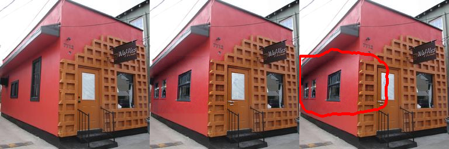
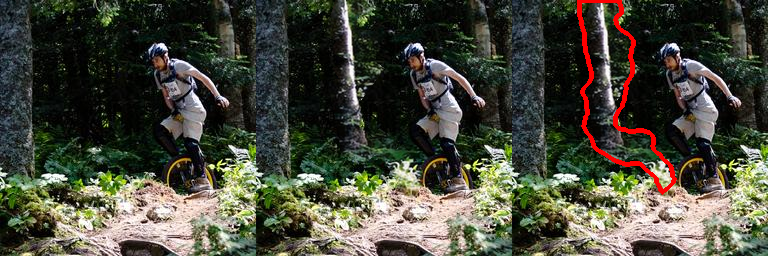

# Computer Vision for AI-Inpainted Image Segmentation
<p align="center">
  
  <br/> 
</p>

Goal of an hackathon I attended in March 2025 (shoutout to Aaltoes), was to accurately detect inpainted (manipulated) regions in images. This binary segmentation task has important applications in digital forensics, media authentication, and combating misinformation.

Achieved validation DICE score was around 0.85.


</p>
  
  <em>From left to right: original image, inpainted image, and predicted mask (using our trained model) overlay.</em>
</p>

## Dataset

- Training set: 28101 image pairs (original + manipulated) with ground-truth masks
- Test set: 18735 manipulated images (without masks)
- Image resolution: 256×256 pixels

Original dataset and pre-processed images are too large to store here.

<p align="center">
  
  <br/> 
  <em>From left to right: original image, inpainted image, and predicted mask (using our trained model) overlay.</em>
</p>

## Architecture and approach

The solution is based on a transformer model (SegFormer) trained to detect manipulated regions in inpainted images. Each image is preprocessed into 7-channel tensors consisting of:

- 3 normalized RGB channels (ImageNet stats)

- 4 handcrafted feature channels: Canny edges, Sobel magnitude, Laplacian, and Fourier magnitude

Original (non-manipulated) images are included in training with zero masks to help the model learn what unaltered content looks like. A __UnifiedDataset__ class loads both manipulated and original images and assigns labels used in a __WeightedRandomSampler__, ensuring ~10% of training samples are original images.

The model is trained using a hybrid BCE + Dice loss. Augmentations include cropping, flips, brightness changes, and CoarseDropout to simulate occlusions. Early stopping and model checkpointing are based on validation Dice and loss.

## Project Structure

```
├── predictions/                 # Saved visualizations of predictions
│   ├── pred_2.png
│   ├── pred_9.png
│   └── pred_12.png
│
├── pyproject.toml               # Dependency definitions (for uv/pdm)
│
├── README.md                    # Project documentation
│
├── src/                         # Source code
│   ├── feature_extraction.py       # Extract RGB, Canny, Sobel, Laplacian features
│   ├── inference.py                # Run trained model and save predictions
│   ├── loss.py                     # Hybrid BCE + Dice loss and Dice metric
│   ├── models/
│   │   ├── unet_model.py           # UNet model with ResNet34 encoder
│   │   └── transformer_model.py    # SegFormer model with partial pretrained weights
│   ├── train.py                    # Full training pipeline with early stopping
│   ├── transform_rle.py            # RLE encoding for submission
│   └── unified_dataset.py         # Combines original + manipulated images for training
│
├── submissions/                 # CSV files for submission (RLE format)
│   └── submissiontransformer_weighted_best.csv
│
├── trained_models/              # Saved PyTorch model weights
│   ├── unet7_bce_dice.pth
│   ├── unet7_dice.pth
│   ├── unet_manip_segmentation.pth
│   ├── segfort_basic_model.pth
│   ├── transformer_model_fixed_patience.pth
│   ├── transformer_with_originals_and_patience.pth
│   ├── transformer_with_originals_freezing.pth
│   └── transformer_weighted_best.pth
│
└── uv.lock                      # Lock file for reproducible environments

```

## Reproduction

1. Install uv (if you haven't already? Like why wouldn't you)
   - ```curl -LsSf https://astral.sh/uv/install.sh | sh```
2. Rest is easy
	- ```uv venv```        # optional: sets up a virtual environment
	- ```uv sync```        # installs everything exactly as locked in uv.lock
3. ```source .venv/bin/activate```
4. run ```feature_extraction.py```
5. then ```train.py```
6. then ```inference.py```